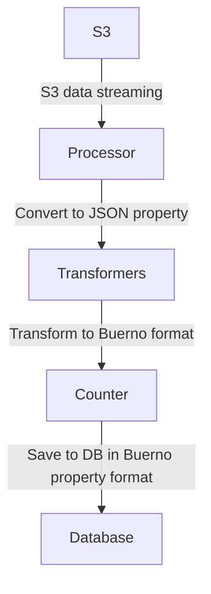

<p align="center">
  <a href="http://nestjs.com/" target="blank"></a>
</p>

## Description

Case study

## Project setup

### Requirement

1. Nodejs
2. Mongodb / Docker compose

### Run Command

1. Copy env
   ```shell
      cp .env.example .env
    ```
1. if you have docker installed, run the mongodb otherwise need mongodb and change environment value in .env file
    ```shell
        docker compose up -d
    ```
2. Install packages.

```bash
npm install
```

## Run the Project

There are 2 services to run, one for API and one for ingesting data to the database, open it seperately.

### Run API Server

The server responsible for providing data externally.  
Currently, only the search endpoint is exposed.

```bash
npm run start:dev:api
```

### Run Feeder Service

The data pipeline that feeds apartment data from several sources.

```bash
npm run start:dev:feeder
```

## API

Import the below curl command in **Postman** or any REST client to test the endpoint:

```bash
curl --location --globoff 'localhost:3000/property?%24limit=10&%24skip=13&source=airbnb&%24sort={%22updatedAt%22%3A-1}&source=housing-anywhere&title=bal' \
--data ''
```

You can pass any field from the [PropertySchema](src/api/property/property.schema.ts) as a query parameter to filter
data.

- **title** → regex match filter exists
- **price** → supports exact match, operator match, and between matches
    - Filter `price > 100` → `pricing.price=">100"`
    - Filter `price < 100` → `pricing.price="<100"`
    - Filter `price between 100 and 120` → `pricing.price=">100<120"`
- Other fields can be passed as query params to filter property data

## Architecture

### Applications

1. **API** – Handles external API communication
2. **Feeder** – Handles data ingestion and feeding to the database

### Feeder

Uses a **stream-based** approach for better memory management, efficiency, and scalability.

Below diagram shows how the [data pipeline](src/feeder/feed-runner.service.ts) (line 21) looks like:



### Feed

To add a new feed, implement the [FeedAbstract](src/feeder/common/abstracts/feed.abstract.ts) in your new feed.

A feed should have:

1. **name** – name of the feed
2. **scheduleAt** – cron schedule time
3. **loader** – how data is loaded (URL, S3, file, etc.)
4. **processor** – how to process it into a consumable JSON format
5. **transformers** – transform the incoming format into **Buerno property format** (final DB format)

After defining the feed, register it in the [registry service](src/feeder/feed-scheduler-registry.service.ts).  
The scheduler automatically picks up registered feeds.

# Note

For better search functionality in production ready environment, I would suggest to use text search technologies such as
elastic search.
